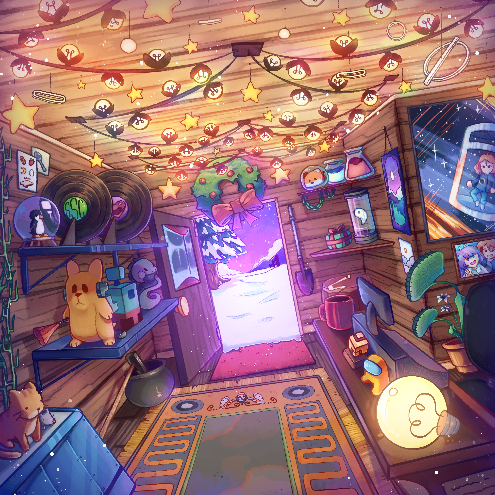

<!--

    
    
    

 -->

    <a class="thing" href="https://intikus.bandcamp.com/album/electrovention">
        
        <!-- 

            <h1>Overthought Madness</h1>
            <h2>Pumpin' Electronic Album </h2>
            
A collection of songs made as a distraction from or reflection of overthinking in stress.

            
<a href="album/b-sides-b-dies" class="icon_album">a</a>

            
Album art: Nautillo

        
 -->
    </a>
    <a class="thing" href="music/madness.html">
        
        <!-- 

            <h1>Overthought Madness</h1>
            <h2>Pumpin' Electronic Album </h2>
            
A collection of songs made as a distraction from or reflection of overthinking in stress.

            
<a href="album/b-sides-b-dies" class="icon_album">a</a>

            
Album art: Nautillo

        
 -->
    </a>
    <a class="thing" href="music/teen angst.html">
        
        <!-- 

            <h1>end of teenage angst</h1>
            <h2>Ambient Album</h2>
            
A collection of tracks made before I turned 20, the names of which being the bitter lingerings I'd wanna leave behind to those days.

            
<a href="album/b-sides-b-dies" class="icon_album">a</a>

            
Album art: Nautillo

        
 -->
    </a>
    
    
    <!-- 
    
     -->
    
    

